# 💫 About Me:

  

## 🌐 SOCIALS

  
  
  

## 💻 TECH STACK

### Coding

  
  
  
  
  
  
  

### Frameworks

  
  
  
  
  
  

### Databases

  
  
  
  

### Cloud & DevOps

  
  
  
  
  
  

### API & Testing Tools

  
  
  

## 📊 GitHub Stats

  
    
  
    
  

---

## 📈 Contribution Graph

  

